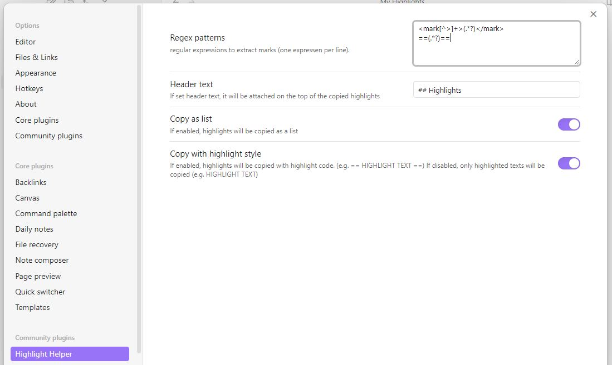
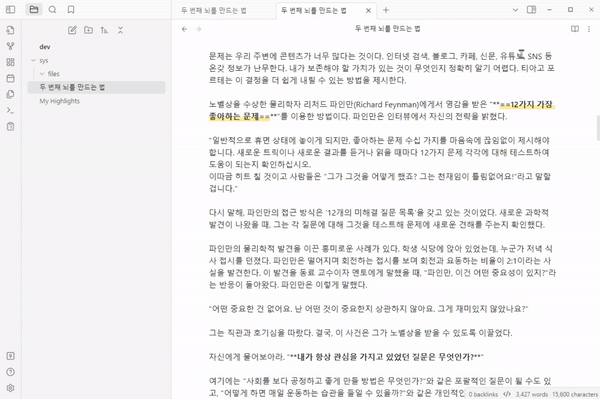

# Obsidian Highlight Helper Plugin

This plugin copies all highlights on the open note in [Obsidian](https://obsidian.md/).

## Screenshots

## Rugular Expressions in Setting
You can use your own regular expressions to collect highlights.
Default values are already set for markdown highlight syntax and [Highlightr Plugin](https://obsidian.md/plugins?id=highlightr-plugin).

## Installation
You can install this plugin in the Community Plugins tab of the [Obsidian](https://obsidian.md/).
Just search for "Highlight Helper" or goto this plugin page : [Link](https://obsidian.md/plugins?id=highlight-helper)

## Credits
If you like this plugin you can by me a coffe on Ko-fi here : 

